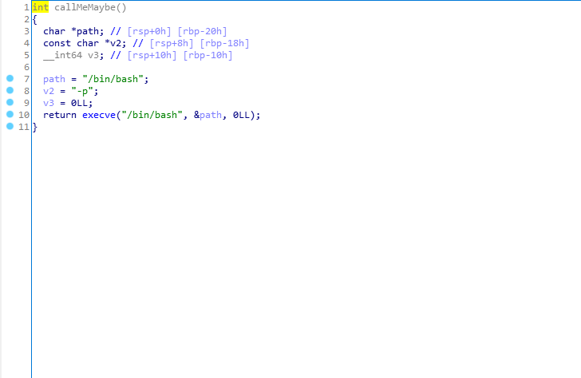

# 사전지식
64비트 기반의 바이너리 파일이기 때문에 아마 ida 64bit로 열어야 한다. 
그리고 32비트의 주소 길이는 8자리였지만 64비트는 두배, 16자리이다. 
이말은 곧 64비트는 rbp, rfp, sfp의 길이가 8byte라는 것이다(!!)    
아 그리고 용어가 살짝 바뀌는데,    
ebp ->  rbp,   efp -> rfp
의미는 같다. 
이정도만 알고 있음 될 것 같다.    

# 풀이

일단 netcat을 통해 문제에 접속해보자.   
    
문자열을 입력받고 ```hello``` 라는 문자열과 함께 입력한 문자열이 출력됨을 확인할 수 있다.    
그럼 이제 IDA로 까볼까?   
> 이 문제의 바이너리 파일은 64비트이기 때문에 IDA도 64비트버전으로 열어야 한다.   
## 바이너리 분석    
     
문자열 변수 s랑 int형 변수 v5가 있다.    
각각 rbp를 기준으로 0x110, 0x04만큼 떨어진 곳에 위치해 있음을 알 수 있다.     
디코딩한 코드를 보자!    
    
s에 문자열을 입력받고, printf로 출력해준다.    
> 아 참고로 리눅스에서 ```checksec```이라는 명령어를 사용하면 걸려있는 보호기법에 대해 파악할 수 있다.  
  
쉘 코드는 막혀있으니 BOF를 일으켜야 할 것 같은데, 어떻게 일으키면 좋을까?    
다행히 우리에겐 희망이 있다.    
    
누가봐도 '날 불러줘요'하는 함수가 있다.  
    
예상대로 쉘 권한을 얻는 함수였다. 그럼 저 함수의 주소값을 가지고 main에서 ret까지 BOF를 일으키면 된다!   
그래도 메모리 구조를 안그리면 섭하니 한번 그려보도록 하겠다.      
    
일단 v5는 그냥 s의 길이를 넣는거라 딱히 상관없어서 일단 sfp전까지 0x110만큼 BOF를 일으키고,    
sfp의 길이가 8byte이기 때문에 0x8만큼 더 BOF를 일으킨 다음    
ret에 위에 있는 flag의 주소를 넣으면 된다!    
## 코드    
```python
 from pwn import *

p = remote("ctf.j0n9hyun.xyz",3004)
flag = 0x0000000000400606
payload = 'R'*0x110
payload += 'I'*0x8
payload +=p64(flag)
p.sendline(payload)
p.interactive()
```   
추가로 64비트이기때문에 p64함수롤 써서 64비트 리틀엔디안으로 바꿔주는 것이다.    